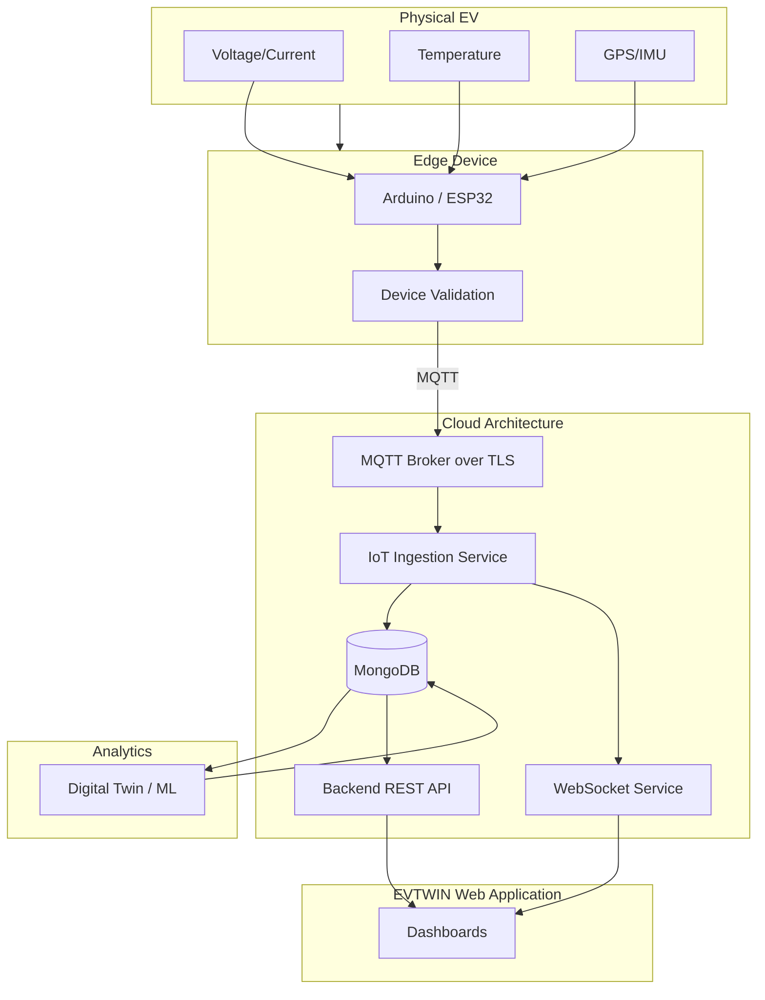

# Complete System Architecture

**Status:** [PARTIALLY IMPLEMENTED]

## 1. Overview
EVTWIN is designed as an intelligent connected-EV platform. The system architecture defines the data flow from physical sensors through IoT ingestion into scalable cloud storage, enabling analytics and real-time visualization.

## 2. Architecture Diagram

## 3. Component Details
- **EV Sensors:** Real hardware currently collects battery voltage, current, and temperature.
- **Edge Device:** Currently prototyped using Arduino/ESP32. Production recommends automotive-grade MCU.
- **IoT Ingestion:** Validates, normalizes, and deduplicates telemetry before storage.
- **Database:** MongoDB serves as the primary data store (currently standard collections; time-series planned).
- **Client:** The website must *never* directly access MongoDB. Communication flows strictly through the API/WebSocket layer.
