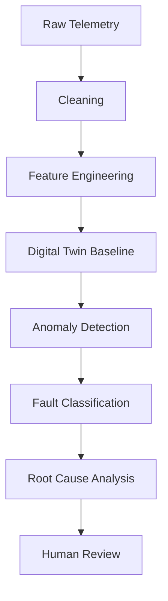

# ML Architecture

**Status:** [PLANNED]

## Purpose
Defines the Machine Learning pipeline for anomaly detection, fault classification, and predictive maintenance in EVTWIN.

## EVTWIN Context & Data Flow

## Security & Failure Modes
- **Security:** ML Inference API is secured via JWT and tenant isolation.
- **Failure:** If inference fails, system defaults to standard thresholds.
- **Confidence:** AI outputs MUST provide confidence scores (e.g., 87%) and Evidence.

## Current vs Planned
- **Current:** Basic threshold alerting.
- **Planned:** Isolation forest for anomaly detection on Battery Thermal behavior.
