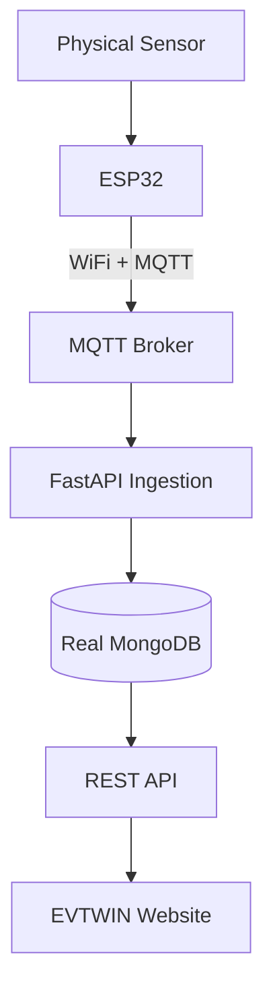

# Hardware Vertical Slice

**Status:** [PROTOTYPE / HARDWARE VERTICAL SLICE]

## 1. Objective
This document defines the architecture and implementation of the **Hardware Vertical Slice**. It replaces the Software Vertical Slice (simulated telemetry) with physical hardware.

## 2. Architecture

## 3. Implementation Notes
- **Source:** All payloads from the MCU must strictly declare `source: "DEVICE"`.
- **Database:** Must use a real MongoDB instance, replacing `mongomock`.
- **Validation:** The ingestion service must validate the payload schema against `TELEMETRY-CONTRACT.md`.
